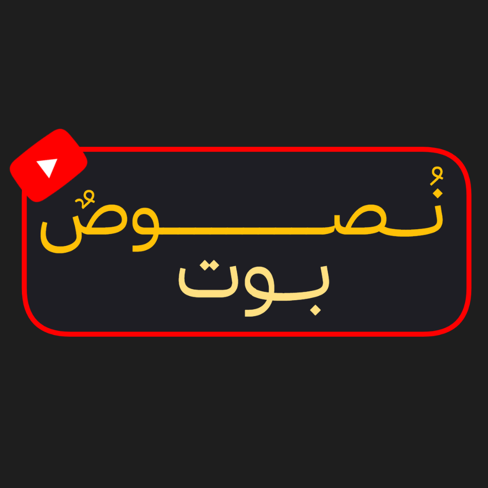
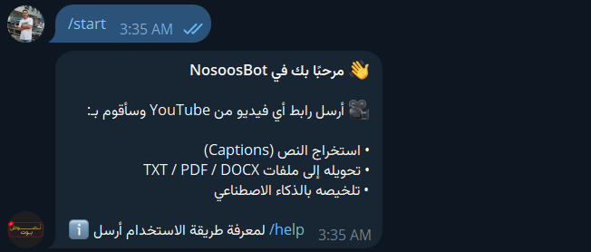
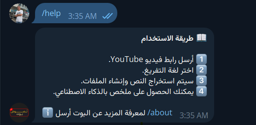
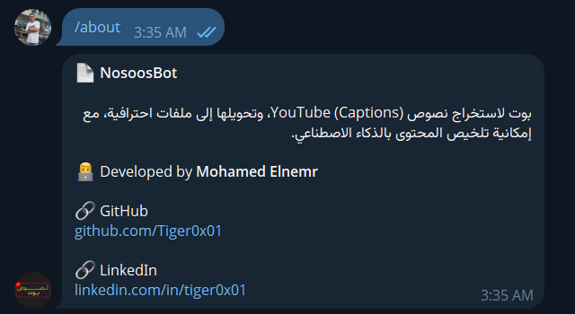

<p align="center">
  
</p>

<h1 align="center">
NosoosBot
</h1>

<p align="center">

Extract • Translate • Summarize • Export YouTube Captions with AI

</p>

<p align="center">

Telegram Bot powered by Python, AI & Groq.

</p>

---

## ✨ Features

- 🎥 Extract YouTube captions
- 🌍 Support multiple transcript languages
- 🔄 Translate transcripts automatically
- 🧹 Clean and format noisy captions
- 🤖 AI-powered summaries using Groq Llama 3.3 70B
- 📄 Export as
  - TXT
  - PDF
  - DOCX
- ⚡ Async processing
- 🚀 Fast transcript caching
- 🔐 Rate limiting
- 📊 Built-in bot statistics
- 📝 Professional PDF generation
- 🧠 Map-Reduce summarization for long videos

---

## 📸 Screenshots

<p align="center">







</p>

---

## 🚀 Workflow

```text

YouTube URL
      │
      ▼
Video Metadata
      │
      ▼
Choose Language
      │
      ▼
Extract Transcript
      │
      ▼
Clean Text
      │
      ├──────────────► Export TXT
      │
      ├──────────────► Export DOCX
      │
      ├──────────────► Export PDF
      │
      ▼
AI Summarization
      │
      ▼
Summary PDF

```

---

## 🛠 Tech Stack

- Python
- Aiogram
- aiohttp
- youtube-transcript-api
- Groq API
- Llama 3.3 70B
- FPDF
- python-docx
- cachetools
- dotenv

---

## 📂 Project Structure

```text
NosoosBot
│
├── ai_service.py
├── media_handler.py
├── doc_generator.py
├── text_cleaner.py
├── config.py
├── main.py
│
├── fonts/
├── downloads/
├── logs/
└── assets/
```

---

## ⚙️ Installation

```bash
git clone https://github.com/Tiger0x01/NosoosBot

cd NosoosBot

pip install -r requirements.txt
```

Create

```
.env
```

```env
TELEGRAM_TOKEN=YOUR_TOKEN

GROQ_API_KEY=YOUR_KEY
```

Run

```bash
python main.py
```

---

## 📦 Output

✅ Clean Transcript

✅ AI Summary

✅ TXT

✅ DOCX

✅ PDF

---

## 🧠 AI Summarization

For short videos:

- Direct summarization

For long videos:

- Chunking
- Parallel processing
- Map-Reduce summarization

---

## 📈 Future Plans

- Speech-to-Text
- Whisper support
- Video Upload support
- OCR from Slides
- Mind Map generation
- Mermaid generation
- Excalidraw export
- Markdown export
- Notion integration

---

## 🤝 Contributing

Contributions are welcome!

Feel free to open Issues or Pull Requests.

---

## ⭐ Support

If you like this project,

⭐ Star this repository.